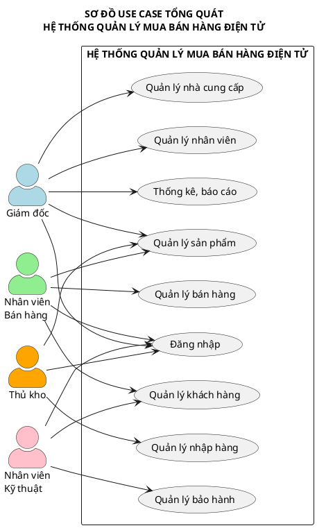
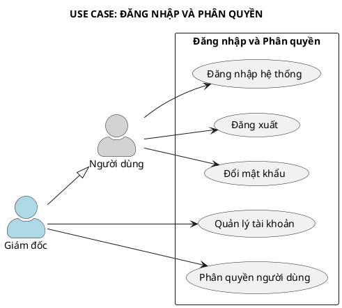
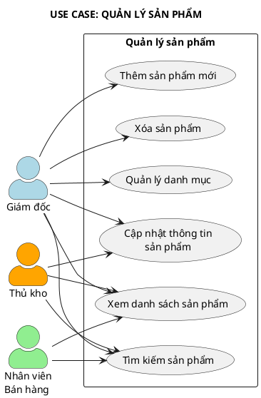
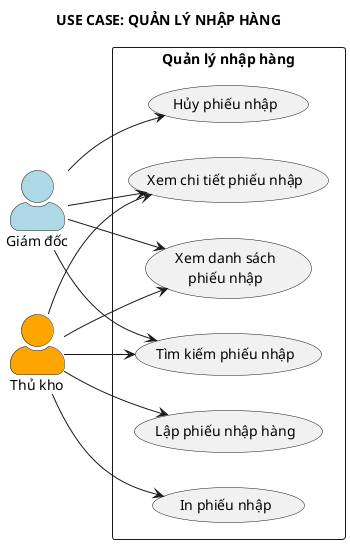
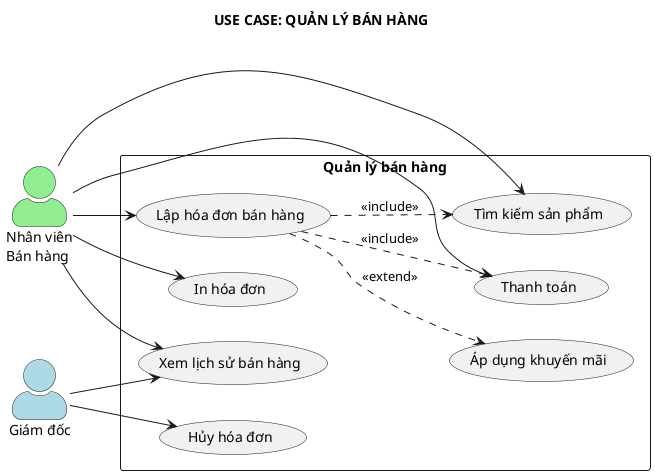
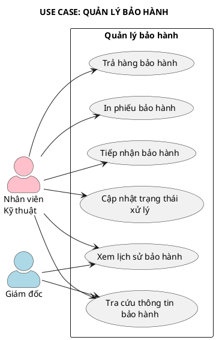
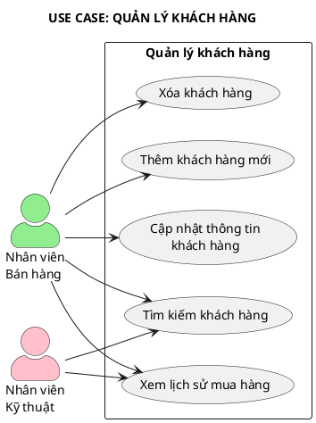
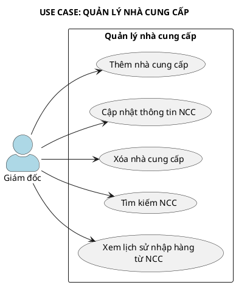
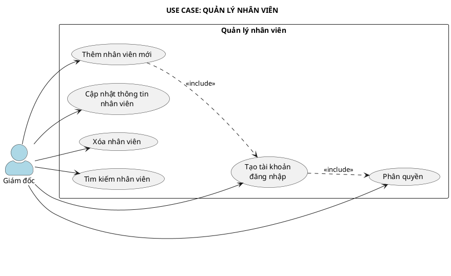
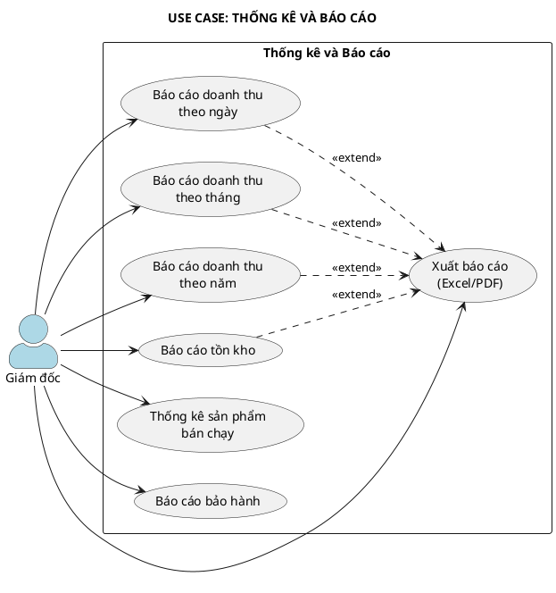

# SƠ ĐỒ USE CASE - HỆ THỐNG QUẢN LÝ MUA BÁN HÀNG ĐIỆN TỬ

## 1. XÁC ĐỊNH TÁC NHÂN (ACTORS)

| STT | Tác nhân | Mô tả |
|:---:|----------|-------|
| 1 | Giám đốc | Quản lý toàn bộ hệ thống, xem báo cáo, quản lý nhân viên |
| 2 | Nhân viên bán hàng | Bán hàng, lập hóa đơn, quản lý khách hàng |
| 3 | Thủ kho | Quản lý nhập hàng, xuất hàng, tồn kho |
| 4 | Nhân viên kỹ thuật | Tiếp nhận và xử lý bảo hành |

---

## 2. SƠ ĐỒ USE CASE TỔNG QUÁT

### Code PlantUML (Copy vào https://www.plantuml.com/plantuml/uml)

---

## 3. SƠ ĐỒ USE CASE CHI TIẾT

### 3.1. Use Case: Đăng nhập và Phân quyền

---

### 3.2. Use Case: Quản lý sản phẩm

---

### 3.3. Use Case: Quản lý nhập hàng

---

### 3.4. Use Case: Quản lý bán hàng

---

### 3.5. Use Case: Quản lý bảo hành

---

### 3.6. Use Case: Quản lý khách hàng

---

### 3.7. Use Case: Quản lý nhà cung cấp

---

### 3.8. Use Case: Quản lý nhân viên

---

### 3.9. Use Case: Thống kê và Báo cáo

---

## 4. BẢNG TỔNG HỢP USE CASE VÀ TÁC NHÂN

| STT | Use Case | Giám đốc | NV Bán hàng | Thủ kho | NV Kỹ thuật |
|:---:|----------|:--------:|:-----------:|:-------:|:-----------:|
| 1 | Đăng nhập hệ thống | ✓ | ✓ | ✓ | ✓ |
| 2 | Đăng xuất | ✓ | ✓ | ✓ | ✓ |
| 3 | Đổi mật khẩu | ✓ | ✓ | ✓ | ✓ |
| 4 | Quản lý tài khoản | ✓ | | | |
| 5 | Phân quyền người dùng | ✓ | | | |
| 6 | Xem danh sách sản phẩm | ✓ | ✓ | ✓ | |
| 7 | Tìm kiếm sản phẩm | ✓ | ✓ | ✓ | |
| 8 | Thêm sản phẩm mới | ✓ | | | |
| 9 | Cập nhật thông tin SP | ✓ | | ✓ | |
| 10 | Xóa sản phẩm | ✓ | | | |
| 11 | Quản lý danh mục | ✓ | | | |
| 12 | Lập phiếu nhập hàng | | | ✓ | |
| 13 | Xem danh sách phiếu nhập | ✓ | | ✓ | |
| 14 | Hủy phiếu nhập | ✓ | | | |
| 15 | Lập hóa đơn bán hàng | | ✓ | | |
| 16 | Thanh toán | | ✓ | | |
| 17 | In hóa đơn | | ✓ | | |
| 18 | Xem lịch sử bán hàng | ✓ | ✓ | | |
| 19 | Hủy hóa đơn | ✓ | | | |
| 20 | Tiếp nhận bảo hành | | | | ✓ |
| 21 | Tra cứu thông tin BH | ✓ | | | ✓ |
| 22 | Cập nhật trạng thái BH | | | | ✓ |
| 23 | Trả hàng bảo hành | | | | ✓ |
| 24 | Thêm khách hàng mới | | ✓ | | |
| 25 | Tìm kiếm khách hàng | | ✓ | | ✓ |
| 26 | Xem lịch sử mua hàng | | ✓ | | ✓ |
| 27 | Thêm nhà cung cấp | ✓ | | | |
| 28 | Cập nhật thông tin NCC | ✓ | | | |
| 29 | Xóa nhà cung cấp | ✓ | | | |
| 30 | Thêm nhân viên mới | ✓ | | | |
| 31 | Cập nhật thông tin NV | ✓ | | | |
| 32 | Xóa nhân viên | ✓ | | | |
| 33 | Báo cáo doanh thu | ✓ | | | |
| 34 | Báo cáo tồn kho | ✓ | | | |
| 35 | Thống kê SP bán chạy | ✓ | | | |
| 36 | Xuất báo cáo Excel/PDF | ✓ | | | |

---

## 5. HƯỚNG DẪN VẼ SƠ ĐỒ

### Cách 1: Dùng PlantUML Online
1. Truy cập: https://www.plantuml.com/plantuml/uml
2. Copy code PlantUML ở trên
3. Paste vào ô nhập liệu
4. Nhấn "Submit" để xem sơ đồ
5. Click chuột phải vào hình → Save image

### Cách 2: Dùng Draw.io
1. Truy cập: https://app.diagrams.net/
2. Chọn "Create New Diagram"
3. Chọn template "UML" → "Use Case Diagram"
4. Vẽ theo mô tả ở trên

### Cách 3: Dùng StarUML
1. Mở StarUML
2. Tạo project mới
3. Add "Use Case Diagram"
4. Kéo thả các Actor và Use Case theo mô tả

---

## 6. GHI CHÚ KÝ HIỆU

| Ký hiệu | Ý nghĩa |
|---------|---------|
| Actor (hình người) | Tác nhân tương tác với hệ thống |
| Oval (hình elip) | Use Case - chức năng của hệ thống |
| Đường thẳng | Quan hệ giữa Actor và Use Case |
| <<include>> | Use Case này BẮT BUỘC gọi Use Case kia |
| <<extend>> | Use Case này CÓ THỂ mở rộng Use Case kia |
| Generalization (mũi tên rỗng) | Quan hệ kế thừa |

